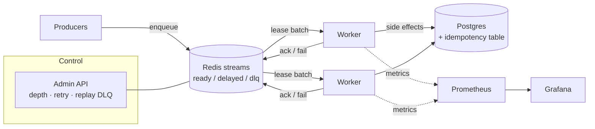

# pulseq

> A distributed task queue with retries, backpressure, a dead-letter queue, and
> idempotent delivery — built to show how asynchronous processing behaves under
> failure, not just on the happy path.

[](#)
[](#)
[](LICENSE)

**Live demo:** _pending_ · **Dashboard:** _pending_

---

## Why this exists

Most queue examples stop at "producer sends, consumer receives." Production queues
live or die on the parts that come after: what happens when a worker crashes
mid-job, when a downstream service is down for an hour, when the same message is
delivered twice, when producers outrun consumers. `pulseq` is a compact,
readable implementation that takes those cases seriously and measures them.

## What it demonstrates

- **At-least-once delivery** with consumer-side **idempotency keys** so retries
  don't double-apply side effects.
- **Exponential backoff with jitter** and a per-job **max-attempts** budget.
- **Dead-letter queue** for exhausted jobs, with a replay command.
- **Backpressure**: bounded in-flight work per worker, producer throttling when
  the queue depth crosses a threshold.
- **Visibility timeout / lease renewal** so a slow job isn't handed to a second
  worker while the first is still alive.
- **Graceful shutdown**: in-flight jobs finish or are re-queued, nothing is lost
  on `SIGTERM`.
- **Observability**: Prometheus metrics (queue depth, processing latency, retry
  rate, DLQ rate) with a bundled Grafana dashboard.

## Architecture



## Tech stack

| Area          | Choice                                          |
| ------------- | ----------------------------------------------- |
| Language      | TypeScript (Node.js)                            |
| Transport     | Redis streams + consumer groups                 |
| Durable state | PostgreSQL (job records, idempotency ledger)    |
| Metrics       | prom-client → Prometheus → Grafana              |
| Tests         | Vitest + Testcontainers (real Redis + Postgres) |
| Packaging     | Docker Compose for the full stack               |

## Getting started

```bash
git clone https://github.com/ingo4it/pulseq.git
cd pulseq
cp .env.example .env
docker compose up -d          # redis, postgres, prometheus, grafana
pnpm install
pnpm migrate
pnpm dev:worker               # start a worker
pnpm demo:load                # push a burst of jobs and watch the dashboard
```

Grafana is at `http://localhost:3000` (admin / admin), dashboard pre-provisioned.

## Benchmarks

Reproduce with `pnpm bench` (results committed under `bench/results/`):

| Scenario         | Throughput | p99 latency | Retry rate |
| ---------------- | ---------: | ----------: | ---------: |
| _to be measured_ |          — |           — |          — |

The load harness injects a configurable failure rate on the downstream so the
retry / DLQ paths are actually exercised in the numbers.

## Project layout

```
src/
  queue/        enqueue, lease, ack, backoff, DLQ
  worker/       run loop, lease renewal, graceful shutdown
  idempotency/  key store + wrap helper
  admin/        HTTP API for depth, retry, replay
  metrics/      prom-client collectors
bench/          load generator + committed results
deploy/         compose, prometheus, grafana provisioning
docs/adr/       architecture decision records
```

## Design notes

Key tradeoffs are written up as ADRs in [`docs/adr/`](docs/adr/):

- ADR-001 — Redis streams over a dedicated broker for this scope
- ADR-002 — At-least-once + idempotency instead of chasing exactly-once
- ADR-003 — Visibility timeout via lease renewal vs. fixed timeout

## Roadmap

- [ ] Priority lanes
- [ ] Cron / scheduled jobs
- [ ] Multi-tenant fairness (weighted round-robin across namespaces)
- [ ] Helm chart

## License

MIT © Frank Rao — [frankrao.com](https://frankrao.com)
