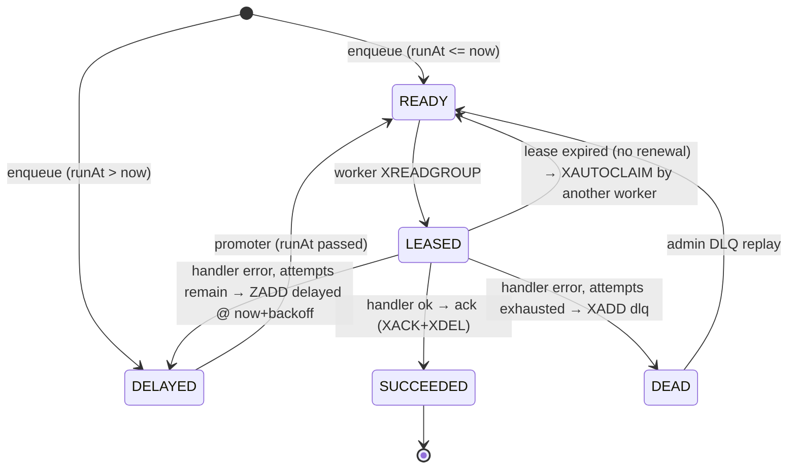

# Architecture

## Shape

```
src/
  config.ts            zod config, frozen at boot
  logger.ts
  producer.ts          Producer: enqueue (+ backpressure-aware enqueue)
  core/
    types.ts           Job/Leased/Envelope/Depth types
    backoff.ts          exponential backoff + jitter (none | full | equal)
    clock.ts            injectable time source
    ids.ts              job ids, worker/consumer names
  db/                   prisma client, redis (two connections per worker)
  queue/
    keys.ts             per-namespace Redis key layout
    scripts.ts          Lua: enqueue, promote_delayed, fail_job, ack_job, replay_dlq
    queue.ts            Queue: enqueue/lease/ack/fail/reclaim/renew/depth/replay
  idempotency/
    store.ts            Postgres ledger (begin / complete / abort / sweep)
    wrap.ts             withIdempotency(key, fn)
  worker/
    handler.ts          JobHandler type + registry
    semaphore.ts        counting semaphore = concurrency bound
    backpressure.ts     producer-side hysteresis gate
    worker.ts           run loop, lease renewal, reclaim, promote, dispatch
    shutdown.ts          SIGTERM sequencing
  handlers/             example job handlers (echo, demo.process)
  metrics/              prom-client collectors + a /metrics + /healthz server
  admin/                Fastify operator API (stats, pause, DLQ replay, job history)
  entrypoints/          worker.ts, admin.ts
bench/                  load generator + (placeholder) results
deploy/                 prometheus + grafana provisioning
```

Redis is authoritative for what runs next. Postgres mirrors every transition for
durability and the admin API, and holds the idempotency ledger. The mirror is
allowed to lag Redis by one transition.

## Redis layout, per namespace

| Key                   | Type                     | Role                                       |
| --------------------- | ------------------------ | ------------------------------------------ |
| `pulseq:{ns}:ready`   | stream + group `workers` | jobs runnable now; leased via `XREADGROUP` |
| `pulseq:{ns}:delayed` | ZSET (score = runAt ms)  | scheduled retries and `delayMs` jobs       |
| `pulseq:{ns}:dlq`     | stream                   | jobs that exhausted `maxAttempts`          |
| `pulseq:{ns}:paused`  | string                   | presence ⇒ workers stop leasing this ns    |

## Job lifecycle



`ack` and `fail` each run as one Lua script, so a job is never simultaneously
un-acked and re-scheduled.

## Worker loop

```mermaid
flowchart TB
  subgraph "per namespace"
    L{paused?} -->|yes| S1[sleep] --> L
    L -->|no| C{free permits?}
    C -->|no| S2[sleep] --> L
    C -->|yes| LEASE["leaseBatch(min(permits, batchSize), BLOCK idlePollMs)"]
    LEASE --> D[dispatch each job]
  end
  subgraph "process-wide timers"
    P["promoteDue() every promoteIntervalMs"]
    R["reclaimExpired() every leaseTtlMs"]
  end
  D --> ACQ[acquire semaphore permit]
  ACQ --> RENEW[start lease-renewal timer]
  RENEW --> RUN[run handler under shutdown AbortSignal]
  RUN -->|ok| ACK[queue.ack + metrics]
  RUN -->|throw| FAIL[queue.fail → retry_scheduled | dead_lettered]
  ACK --> REL[clear timer, release permit]
  FAIL --> REL
```

Backpressure is two-sided: the **consumer** never leases more than its free
semaphore permits (`WORKER_CONCURRENCY`); the **producer** calls
`BackpressureGate.waitForCapacity()`, which blocks while ready+delayed depth is
above the high watermark and only releases below the low watermark (hysteresis,
so it doesn't flap).

## Graceful shutdown

On `SIGTERM`: stop leasing, abort the shared `AbortSignal` (long handlers should
observe it), wait for in-flight jobs up to a deadline. Anything still running
past the deadline is left untouched — its lease lapses and another worker
reclaims it (ADR-0003). Nothing that didn't complete is acked, so nothing is
lost.
